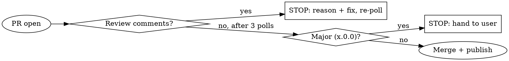

# Publish Release Runbook

## Overview

The repeatable end-of-branch workflow for shipping a planning extension to the VS Code
Marketplace. Nine steps with two hard STOP gates (major version, review comments). Follow it in
order; do not skip the gates.

**This repository holds more than one extension.** Every command below takes a package directory,
and the release tag carries which one. There is no root `package.json` and there never will be —
`cd` into the package first, or the version you read is nobody's.

| | |
|---|---|
| **Publisher** | `darthmolen` |
| **Packages** | one directory per extension under `src/` — today just `src/planning-reminders` |
| **Tag scheme** | `<package>-vX.Y.Z`, e.g. `planning-reminders-v0.2.0` |
| **Publish** | tag-triggered `release.yml` Action (`vsce publish`); local `vsce` is the fallback |
| **PAT** | repo secret `VSCE_PAT` for CI; `MarketplaceAdoPat` in `.env` (gitignored) locally |

The PAT is an Azure DevOps token scoped to *Marketplace → Manage*. **It is bound to the publisher
account, not to an extension** — the same value ships every package under `src/`, and a new
extension needs no new secret.

## Non-negotiables

- **Publishing happens on `main` only** — via the tag pushed on main, or the local fallback, which
  re-confirms `git branch --show-current` = `main` first.
- **The tag must name a real package and match its version.** `release.yml` guards both and fails
  the release on either mismatch.
- **Never print, echo, log, or commit `.env` or the PAT.** In CI it is the `VSCE_PAT` secret.
  Locally, read it into a variable at point of use, pass it via the `VSCE_PAT` env rather than
  argv, and `unset` it.
- **Never stage `.env`.** Verify it is not staged before committing (step 4).
- **STOP on a major/breaking change** (breaking or architectural rewrite, OR version `x.0.0`) —
  hand back to the user (step 7).
- **STOP on human review comments** — evaluate before merging (step 6).
- **No AI attribution** in commits, PR titles or bodies, tags, or release notes.

## The two STOP gates



## Steps

### 1. Verify a unique branch, and fix the package

```bash
BRANCH=$(git branch --show-current)
[ "$BRANCH" = "main" ] && { echo "On main — create a feature branch first"; exit 1; }

PKG=planning-reminders          # the directory under src/, and the tag prefix
DIR="src/$PKG"
ID="darthmolen.$PKG"
cd "$DIR"
```

Everything from here runs in `$DIR`.

### 2. Determine the version from the LAST PUBLISHED version

The marketplace is authoritative — do not trust local tags or `package.json`, which lag or lead.
Parse the labeled `Version:` line, not the first number in the output: `vsce show` prints a version
*table* near the top too, and the first semver in it matches only by luck of ordering.

```bash
PUBLISHED=$(npx vsce show "$ID" 2>/dev/null \
  | grep -iE '^\s*Version:' | grep -oE '[0-9]+\.[0-9]+\.[0-9]+' | head -1)
CURRENT=$(node -p "require('./package.json').version")
echo "published=${PUBLISHED:-<none>}  package.json=$CURRENT"
```

**First publish is the one time an empty `$PUBLISHED` is correct.** The extension does not exist on
the marketplace yet, so there is nothing to read and nothing to compare against; ship `$CURRENT` as
it stands. **Every release after that must treat an empty value as a failure** — an unparsed
`$PUBLISHED` makes the duplicate guard below pass vacuously, because every comparison against the
empty string succeeds, and the first thing you would learn is a rejected publish. A cold `npx vsce`
has returned empty once for an extension that plainly existed, so re-run before concluding anything:

```bash
if [ -z "$PUBLISHED" ]; then
  echo "No published version found. This is only OK if $ID has never shipped."
  echo "Otherwise re-run — a cold npx vsce can come back empty — then check by hand."
fi
```

Pick the next version relative to `$PUBLISHED` (table below), then make `package.json` `version`
equal it. Edit **surgically** — `sed -i '0,/"version": "X"/s//"version": "Y"/'` or equivalent. Do
**not** rewrite the file with `JSON.parse` and `JSON.stringify`: that reformats every line and
buries a one-line bump in an unreviewable diff.

Guard: if the chosen version is **≤ `$PUBLISHED`**, STOP — you are not ahead of the marketplace and
the publish is rejected as a duplicate.

| Change kind | Bump | From 0.2.0 → |
|---|---|---|
| New feature, UI, or capability; or a batch of fixes | **minor** (reset patch) | `0.3.0` |
| Single small bug fix, no new capability | **patch** | `0.2.1` |
| Breaking or architectural rewrite | **major** | `1.0.0` → **STOP at step 7** |

When in doubt, bump minor. A "small feature" is still a feature.

#### Then sync `package-lock.json`, and gate on it

**The surgical edit touches `package.json` only, and that is exactly how the lock file gets left
behind.** `package-lock.json` carries the version **twice** — at the root and again under the
empty-string key in `packages` — and nothing downstream complains when they are stale: the
extension builds, the suite passes, the VSIX packages, and the publish succeeds. In the sibling
copilot-cli repository this was missed three releases running, found sitting at 3.10.0 while
shipping 3.13.0.

```bash
npm install --package-lock-only
```

Gate — all three must agree before you commit:

```bash
PKG_V=$(node -p "require('./package.json').version")
LOCK_ROOT=$(node -p "require('./package-lock.json').version")
LOCK_SELF=$(node -p "require('./package-lock.json').packages[''].version")
echo "package.json=$PKG_V  lock.root=$LOCK_ROOT  lock.self=$LOCK_SELF"
[ "$PKG_V" = "$LOCK_ROOT" ] && [ "$PKG_V" = "$LOCK_SELF" ] \
  || { echo "VERSION MISMATCH — run: npm install --package-lock-only"; exit 1; }

git diff --stat package-lock.json    # expect a handful of lines, not hundreds
```

A lock file that resolved new transitive versions is a different change and does not belong in a
release commit.

### 2b. Merge `main` in first — a stale branch silently reverts released work

A branch cut before the last release does not carry that release's changelog entry or version bump.
Notice it at PR time and it is already too late to see clearly: the diff shows them as
**deletions**, which reads as intent rather than staleness.

```bash
git fetch origin
git rev-list --left-right --count origin/main...HEAD   # left = commits you are MISSING
git merge origin/main
```

Expect conflicts in `CHANGELOG.md` and `package.json`. Resolve them the same way every time: **keep
both changelog entries, newest first**, and **keep your version**, not main's. Then re-run the
version gate — the merge can drag `package.json` backwards.

### 3. Pre-flight gate — must be green before committing

```bash
npm run compile && npm test && ./test-extension.sh      # or .\test-extension.ps1 on Windows
```

CI runs `compile` and the suite on every PR, so this is a fast local echo of the real gate rather
than the only place tests run. `./test-extension.sh` is the part CI cannot do: it packages the VSIX
and installs it into the running editor. It also asserts the pure modules still import nothing from
`vscode`, which is the property the whole test strategy rests on.

`code --install-extension … --force` is **global to VS Code**. If a second worktree is in use,
whichever ran it last wins silently — coordinate first, or skip the install and say so in the PR.
Do not report the gate as green when part of it was skipped.

### 4. Update the changelog, then commit and push

`CHANGELOG.md` is what the marketplace renders on its own tab. Move the entry out of
`## [Unreleased]` into `## [X.Y.Z] - <date>`.

```bash
cd "$(git rev-parse --show-toplevel)"
git add -A
git diff --cached --name-only | grep -qx '.env' && { echo ".env is staged — abort"; git restore --staged .env; }
git commit -m "vX.Y.Z: <concise summary>"     # NO AI attribution
git push -u origin "$BRANCH"
```

### 5. Open the PR to main

```bash
gh pr create --base main --head "$BRANCH" --title "vX.Y.Z: <summary>" --body "<what/why + test results>"
PR=$(gh pr view --json number -q .number)
```

### 6. Poll for review comments — 3 times, ~5 minutes apart

Pace the loop with **ScheduleWakeup** (`delaySeconds: 300`, `reason: "polling PR #$PR for review"`),
re-firing up to 3 times. (ScheduleWakeup is a main-agent tool; a subagent without it should wait
between checks instead.) On each wake:

```bash
gh pr view "$PR" --json reviewDecision,reviews,comments
gh api "repos/darthmolen/vscode-extensions-planning/pulls/$PR/comments"   # inline review comments
```

**BREAK the poll immediately on ANY human review comment or `reviewDecision=CHANGES_REQUESTED`.**

Then **REQUIRED SUB-SKILL:** use `superpowers:receiving-code-review` to evaluate each point on its
merits — verify, do not blindly comply — make the warranted fixes, push, and **restart the poll from
step 6**. Only a full clean poll cycle continues to step 7.

Require the **CI check green** before merging (`gh pr checks "$PR"`).

### 7. Gate on major/breaking, else squash-merge to main

- **If this is a major or breaking release — a breaking or architectural change, OR the version is
  `x.0.0`: STOP.** Tell the user and wait for explicit approval. Do not merge, publish, or tag.
- Otherwise:

```bash
gh pr merge "$PR" --squash    # --admin only if branch protection blocks AND the poll was clean
```

### 8. Switch to main and pull

```bash
git checkout main && git pull origin main
```

### 9. Tag on main → the Action publishes

The tag names the package *and* the version, and `release.yml` derives both from it. Push the tag;
CI guards that the package's `package.json` agrees, runs compile and the suite, packages,
publishes, and cuts the GitHub release.

```bash
[ "$(git branch --show-current)" = "main" ] || { echo "not on main — abort"; exit 1; }
VER=$(node -p "require('./src/$PKG/package.json').version")
git tag "$PKG-v$VER" && git push origin "$PKG-v$VER"

gh run watch "$(gh run list --workflow=release.yml -L1 --json databaseId -q '.[0].databaseId')" --exit-status
```

Confirm on the marketplace (`npx vsce show "darthmolen.$PKG"`), then celebrate.

**Fallback (CI down, secret missing):** publish locally from `main` only — guard the branch, keep
the PAT off argv, tag only after the publish succeeds.

```bash
[ "$(git branch --show-current)" = "main" ] || exit 1
trap 'unset PAT VSCE_PAT' EXIT
PAT=$(grep '^MarketplaceAdoPat=' .env | cut -d= -f2-)
cd "src/$PKG"
VSCE_PAT="$PAT" npx vsce publish        # env, not argv
VER=$(node -p "require('./package.json').version")
cd - >/dev/null && git tag "$PKG-v$VER" && git push origin "$PKG-v$VER"
```

## Quick reference

| Step | Command / action |
|---|---|
| 1 branch | `git branch --show-current` ≠ `main`; set `PKG`, `cd src/$PKG` |
| 2 version | `npx vsce show` → next per table → surgical edit → `npm install --package-lock-only` → three-way gate |
| 2b sync | `git merge origin/main`; keep both changelog entries, keep your version |
| 3 gate | `npm run compile && npm test && ./test-extension.sh` |
| 4 push | changelog entry → `git commit -m "vX.Y.Z: …"` → `git push -u origin $BRANCH` |
| 5 PR | `gh pr create --base main --title "vX.Y.Z: …"` |
| 6 poll | ScheduleWakeup 300s ×3; break on ANY comment; CI green |
| 7 merge | breaking/major → STOP; else `gh pr merge $PR --squash` |
| 8 main | `git checkout main && git pull` |
| 9 ship | `git tag "$PKG-v$VER" && git push origin "$PKG-v$VER"` → `gh run watch` |

## Common mistakes

- **Reading the version from the wrong directory.** There is no root `package.json`. Requiring
  `./package.json` from the repository root throws, and from the *other* extension's directory it
  silently returns someone else's number.
- **Tagging `v0.3.0` instead of `planning-reminders-v0.3.0`.** The workflow only triggers on `*-v*`
  and derives the package from the prefix. A bare tag ships nothing and reports nothing.
- **Publishing from the feature branch.** Publishing happens at step 9 on `main`. The VSIX built on
  the branch is for local testing only.
- **Tagging before the bump reaches main.** The Action fails when the tag and the manifest disagree.
  Bump (step 2), merge (step 7), pull (step 8), *then* tag.
- **Bumping from `package.json` instead of the marketplace.** Local versions and tags run ahead or
  stale; `vsce show` is the source of truth for "last published".
- **Editing `package.json` and leaving `package-lock.json` behind.** Nothing downstream fails, so
  only the step-2 gate catches it.
- **Treating an empty `vsce show` as a first publish** on an extension that has already shipped. It
  is a cold-run artifact; re-run before believing it.
- **Merging a major without asking.** `x.0.0` always stops for the user.
- **Continuing past review comments** because they "seem minor" — evaluate every one first.
- **Leaking the PAT** by echoing `.env` or passing it on a logged command line.
